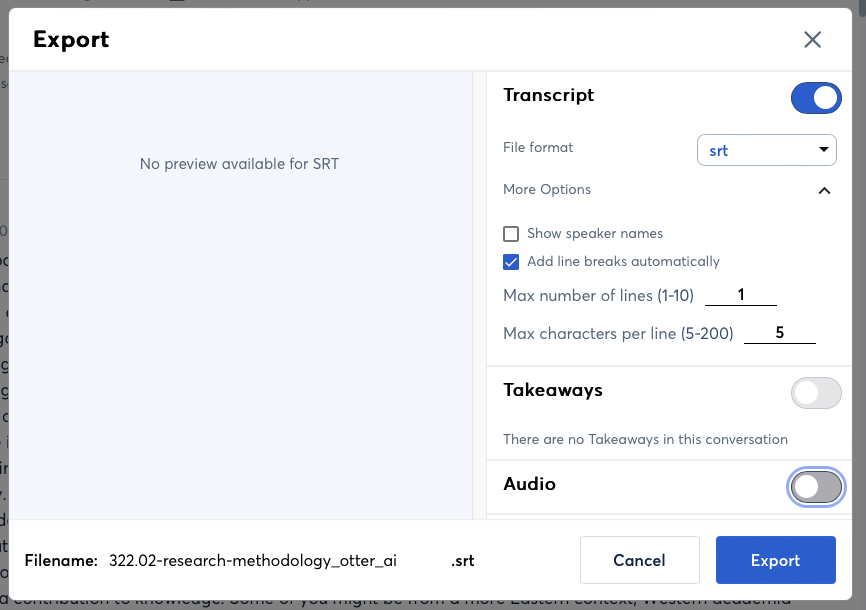

= README

== Installation: Ubuntu

Install Python using `apt`:

[source, bash]
----
sudo apt install python3 ffmpeg
----

Install required Python libraries using `pip3` at the root of the project directory:

[source,bash]
----
pip3 install -r requirements.txt
----

Optionally, to work with the graphical user interface you need the `tkinter` module.  To install from an `apt` package:

[source, bash]
----
sudo apt install python3-tk
----

== Modes

There are currently three modes of operation supported by the library.

* Subtitling -- subtitles are displayed in the translated language

* Dubbing -- translated audio using TTS.  Since TTS audio can have a different duration than the translated audio, the video is stretched (slowed down) or compressed (sped up) to fit the TTS audio.

* Translation -- Video has both the original language and the translated TTS audio (the video freezes for the translated audio)

== Data Storage

Date is stored in a compressed file (gzip) in JSON format.  The root object is a `Transcript` object (dubbing_tools.transcript).  The `Transcript` object has two arrays (lists) for words (dubbing_tools.word) and phrases (dubbing_tools.phrase).  Each `Phrase` in the list contains the source phrase (original language of the video) and any target phrases (languages into which the orignal has been translated).

* *words* -- the words list contains an entry for every word (dubbing_tools.word) in the transcript along with its start time (when the speaker began saying the word) and its end time (when the speaker finished saying the word).

* *phrases* -- phrases are built from the *words* data and are like *words* in that they have start and end timings.  Each entry in the phrase list has two types of phrases.

  - *source* -- phrases built from the words list

  - *target* -- phrases translated from the source phrases.  A source phrase can have translations to multiple languages.  Further each translated phrase can have multiple timings.

    ** *src* -- timings equal to those of the source language.  This is the timing that would be used for displaying subtitles.

    ** *dub* -- timings for dubbed TTS.  TTS generated audio can have a different duration (longer or shorter) than the source language and therefore timings need to be adjusted.

    ** *trn* -- timings for having both the original language audio and the translated language audio.

For details of all the data stored see `dubbing_tools.transcript`.

== Project Folder Structure

All files belonging should be contained in a single folder with the following structure.

* *transcript.json.gz* -- gzipped JSON data file containing text and timings

* `./bak` -- when *transcript.json.gz* is updated the old version is copied into this directory
  with an ascending numeric suffix appended.

* `./videos`

  - *source.mp4* -- Source video file

* `./audio-clips` -- storage for TTS audio

== Process

1. Extract audio from the video file
+
[source, bash]
----
ffmpeg -i <video>.mp4 <audio>.mp3
----

2. STT conversion at https://otter.ai

    a. Upload to Otter for STT conversion.

    b. Edit the transcript and resync the edited text to the audio

    c. Download as `.srt` subtitles.
+

3. Create a project using `dt-import-words-srt`
+
[source, bash]
dt-import-words-srt <project path> <subtitle file>.srt --lang=en
